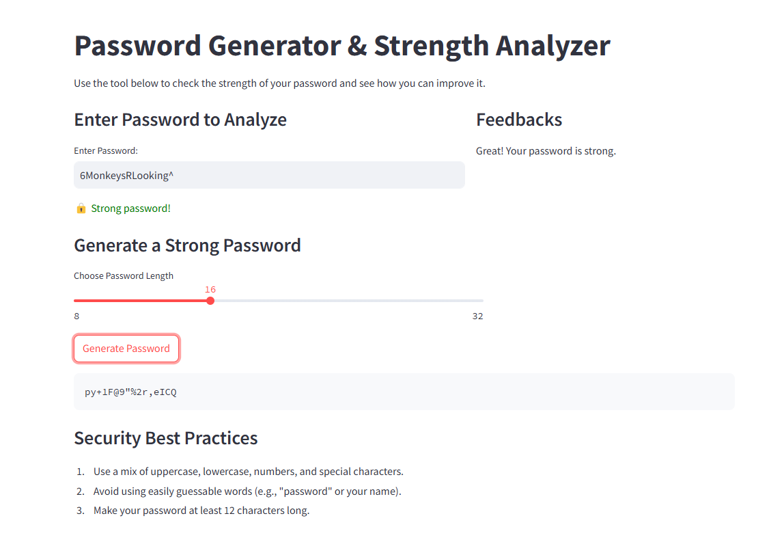

# Password Strength Analyzer and Generator

This Streamlit app helps users analyze the strength of their passwords and generate strong passwords. It checks password strength based on various criteria such as length, presence of uppercase letters, numbers, special characters, and non-letter characters. It also provides feedback and suggestions for improving password strength.


## Features
- **Password Strength Analysis**: Check whether a password is weak or strong according to predefined security policies.
- **Password Feedback**: Get suggestions for improving password strength.
- **Random Password Generator**: Generate strong passwords based on length requirements.
- **Security Best Practices**: Displays best practices for creating strong passwords.

## Technologies Used
- **Streamlit**: For building the web app interface.
- **Password Policy**: For checking password strength based on custom policies.
- **Python**: For backend logic and handling password validation.
- **CSS**: For customizing the appearance of the app (including slider and layout).

## Installation
To run this app locally, follow these steps:

### 1. Clone the repository:
```bash
git clone https://github.com/your-username/password-strength-analyzer.git
cd password-strength-analyzer
```

### 2. Install dependencies:
Make sure you have Python 3.7+ installed. You can create a virtual environment and install the dependencies using the following:

```bash
python -m venv venv
source venv/bin/activate  # On Windows, use `venv\Scripts\activate`
pip install -r requirements.txt
```

The requirements.txt should contain the necessary libraries:
```bash
streamlit
password-strength
```

You can create this file by running:
```bash
pip freeze > requirements.txt
```

### 3. Run the app:
```bash
streamlit run app.py
```
This will start the app on your local machine and open it in your browser.

## Customization
If you'd like to modify the app, here's a quick overview of customization options:

### Password Policy
You can modify the password policy by changing the `PasswordPolicy.from_names` function parameters:
```python
policy = PasswordPolicy.from_names(
    length=12,  # Minimum length: 12
    uppercase=2,  # At least 2 uppercase letters
    numbers=1,  # At least 1 digit
    special=1,  # At least 1 special character
    nonletters=1  # At least 1 non-letter character
)
```

### App Layout
The layout can be adjusted by modifying the `st.columns()` and other Streamlit layout components.

### Styling
You can modify the appearance using custom CSS in the `st.markdown` section.

### Contributing
Contributions are welcome! If you find a bug or have a feature request, please open an issue on the GitHub repository.

### License
This project is licensed under the MIT License - see the [LICENSE](LICENSE) file for details.
